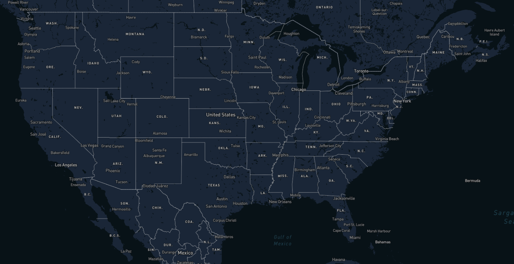
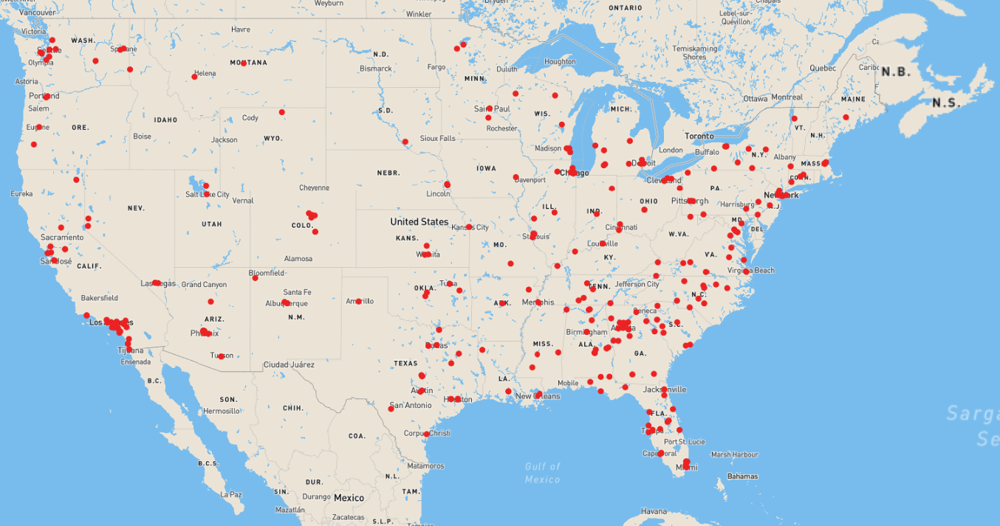
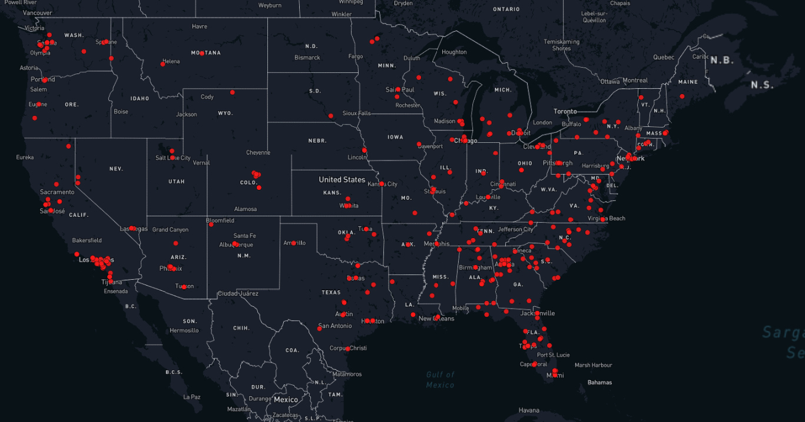
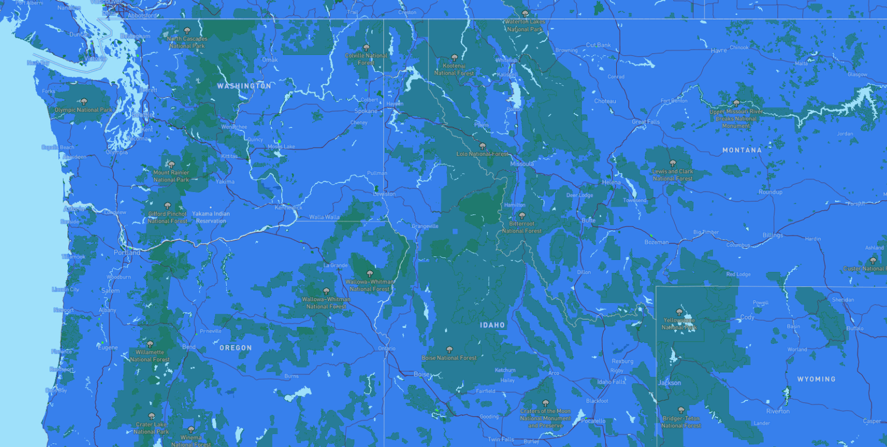

<!DOCTYPE html>

<head>
    <h1> Lab 4: Map design and Tile Generation </h1>
    <a href='https://tribiab.github.io/geog458lab4/index'> Click Here for Trevor's Web Map! </a>
</head>

<body>
    <h4> Screenshots of the Four Layers: </h4>
    <strong> Layer 1: Basemap </strong>
    
    <ul>
        <li> Examined Geographic Area: <strong> USA </strong></li>
        <li> Available zoom levels: <strong> 1 - 8 (low)</strong></li>
        <li> Brief Description: This is the starting basemap that I chose. I manipulated the colors so that bodies of water would not take away from the visual elements I plan to put onto the map.    </li>
    </ul>
    <strong> Layer 2 (thematic): Mass Shooting Events </strong>
    
    <ul>
        <li> Examined Geographic Area: <strong> USA </strong></li>
        <li> Available zoom levels: <strong> 1 - 8 (low)</strong></li>
        <li> Brief Description: This map was created through mapbox studios, in which I visualized <strong>mass shooting events</strong> across America from 1996 to 2016. I first found a dataset with geographic reference (lat, long), and used mapbox to visualize these points onto a blank basemap. I chose to have a low zoom level here because I simply wanted to visualize my data on a blank basemap, it is not intended to zoom in very close, therefore to save space and runtime, I chose to keep the zoom low. I hope to show the significance of choosing the right basemap, because personally I find this thematic map to be visually displeasing.    </li>
    </ul>
    <strong> Layer 3: Mass Shootings + Basemap </strong>
    
    <ul>
        <li> Examined Geographic Area: <strong> USA </strong></li>
        <li> Available zoom levels: <strong> 1 - 10 (high) </strong></li>
        <li> Brief Description: This map is the result of adding my thematic layer of mass shootings onto my original basemap. Notice that the red circles are more proiment when layered on top of the dark basemap. My intentions with this visualization was to clearly show the locations of mass shootings, nothing more. Thus, my choice to omit bodies of water for visual minimalism worked out in my favor.   Furthermore, I increased the <strong>zoom level</strong> for this map because I intended for the audience to use this map to conduct exploratory analysis. I noticed that with a max zoom level of 8, I could barely zoom into Seattle without the image getting blurry. Hopefully, by increasing the maximum zoom, users can use this tool more accurately.   </li>
    </ul>
    <strong> Layer 4: Earth Day Theme </strong>
    
    <ul>
        <li> Examined Geographic Area: <strong> USA </strong></li>
        <li> Available zoom levels: <strong> 1 - 8 (low) </strong></li>
        <li> Brief Description: I was inspired by Earth Day, which happened on Friday, April 22. I've recently learned more about environental activism and I wanted to create a theme that would represent that. I chose 1 - 8 zoom because there is not much functionality to this thematic map. Thus, because of this, I kept the zoom levels low.    </li>
    </ul>
</body>